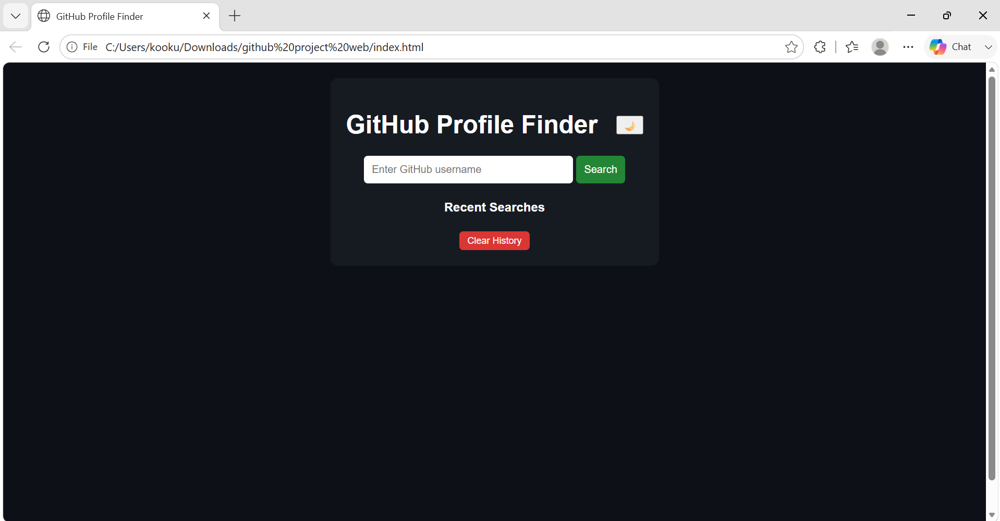
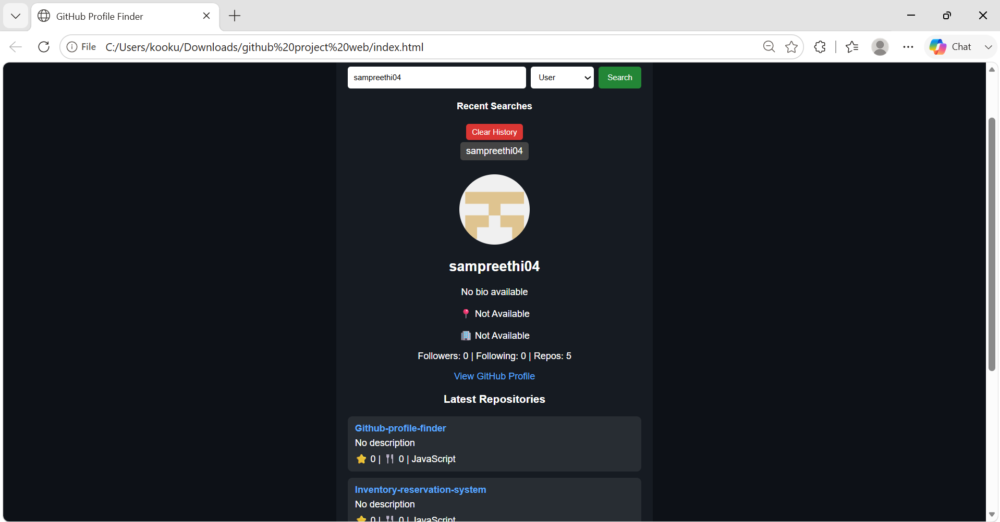
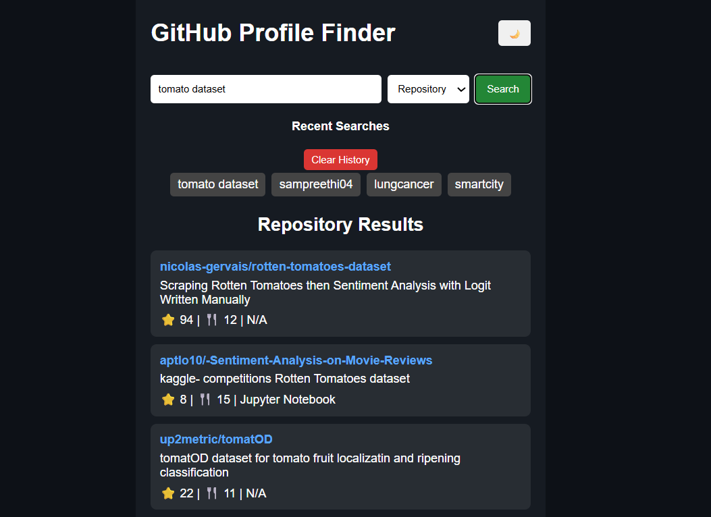
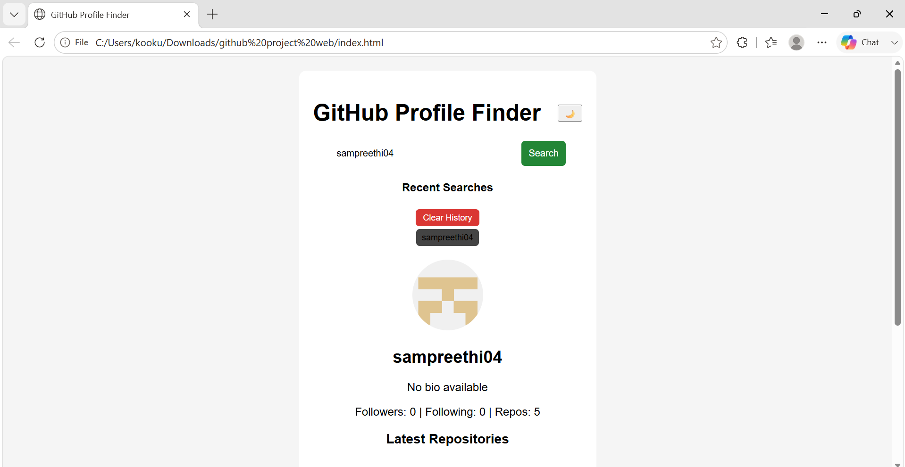
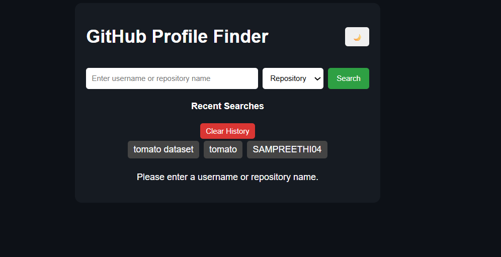

# GitHub Profile Finder

A responsive web application that allows users to search GitHub profiles and repositories using the **GitHub REST API**. Users can search by **GitHub username** or **repository name**, view detailed profile information and repositories, switch between **Light** and **Dark** themes, and manage recent search history through a clean and interactive interface.

---

## Features

- **User Profile Search**  
  Search any GitHub user by entering their username and instantly retrieve their public profile information.

- **Repository Search**  
  Search GitHub repositories by repository name and browse matching public repositories.

- **Detailed Profile Information**  
  Displays the user's profile picture, name, bio, location, company, followers, following count, and total public repositories.

- **Repository Listing**  
  View all public repositories of the selected user along with repository details.

- **Profile Navigation**  
  Provides a direct link to the user's GitHub profile for easy access.

- **Light & Dark Theme**  
  Switch between Light Mode and Dark Mode for a personalized browsing experience.

- **Recent Search History**  
  Automatically stores recent searches, allowing users to quickly revisit previously searched usernames or repositories.

- **Clear Search History**  
  Remove all saved search history with a single click.

- **Error Handling**  
  Displays appropriate error messages for invalid usernames, unavailable repositories, or failed API requests.

- **Responsive Design**  
  Optimized interface that provides a seamless experience across desktop, tablet, and mobile devices.

- **GitHub REST API Integration**  
  Fetches real-time data directly from the GitHub REST API to display accurate and up-to-date information.

---

## Technologies Used

- HTML5
- CSS3
- JavaScript (ES6)
- GitHub REST API

---

## Project Structure

```text
Github-profile-finder/
│
├── index.html
├── style.css
├── script.js
├── README.md
├── homepage.png
├── username-search.png
├── repository-search.png
├── theme-toggle.png
└── search-history.png
```

---

## Installation

1. Clone the repository.

```bash
git clone https://github.com/sampreethi04/Github-profile-finder.git
```

2. Open the project folder.

3. Open `index.html` in any modern web browser.

No additional installation or dependencies are required.

---

## How It Works

1. Select the search type (**User** or **Repository**) from the dropdown menu.
2. Enter a GitHub username or repository name.
3. Click the **Search** button.
4. The application sends a request to the GitHub REST API.
5. Profile information or repository details are fetched and displayed.
6. Every successful search is automatically saved in the **Recent Searches** section.
7. Users can clear the search history using the **Clear History** button.
8. Switch between **Light Mode** and **Dark Mode** at any time using the theme toggle.

---

## Screenshots

### Home Page



---

### Search by Username



---

### Search by Repository



---

### Theme Toggle (Light/Dark Mode)



---

### Recent Search History



---

## Author

**Sampreethi Kookutla**

GitHub: https://github.com/sampreethi04
