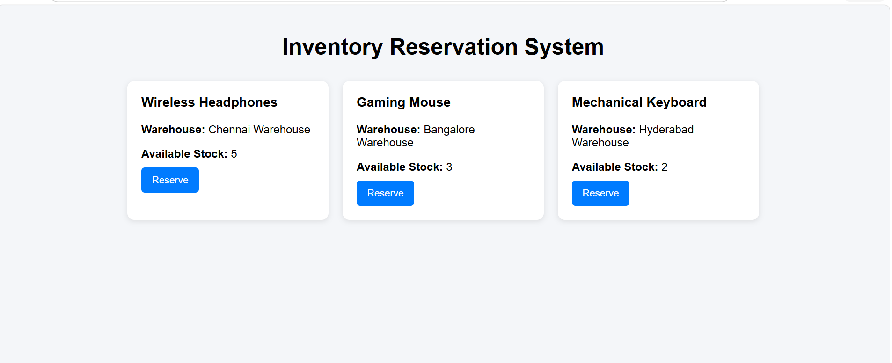
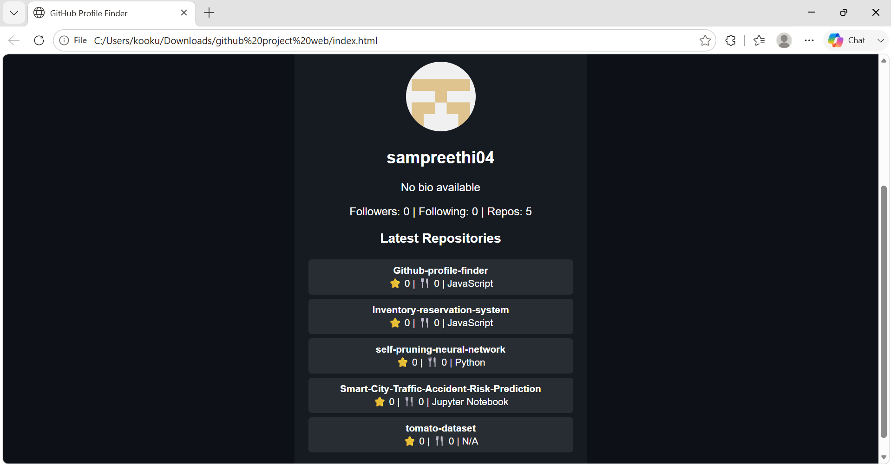
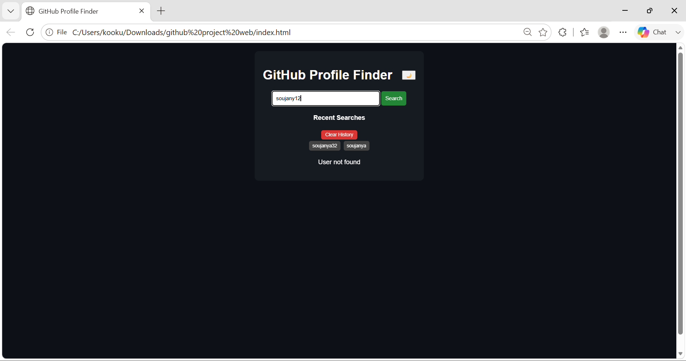

# GitHub Profile Finder

A responsive web application that allows users to search for GitHub profiles using the **GitHub REST API**. The application retrieves and displays public GitHub user information, including profile details, repositories, followers, and following count through a clean and user-friendly interface. It also supports switching between **Light Mode** and **Dark Mode** for an enhanced user experience.

---

## Features

- Search GitHub users by username
- Display profile picture, name, bio, location, and company
- View public repositories
- Show followers and following count
- Direct link to the user's GitHub profile
- Toggle between Light Mode and Dark Mode
- Displays an error message for invalid usernames
- Responsive design for desktop and mobile devices

---

## Technologies Used

- HTML5
- CSS3
- JavaScript (ES6)
- GitHub REST API

---

## Project Structure

```text
Github-profile-finder/
│
├── index.html
├── style.css
├── script.js
├── README.md
├── homepage.png
├── product-list.png
├── repositories.png
├── theme-toggle.png
└── invalidname.png
```

---

## Installation

1. Clone the repository.

```bash
git clone https://github.com/sampreethi04/Github-profile-finder.git
```

2. Open the project folder.

3. Open `index.html` in any modern web browser.

No additional installation or dependencies are required.

---

## How It Works

1. Enter a GitHub username in the search box.
2. Click the **Search** button.
3. The application sends a request to the GitHub REST API.
4. The retrieved profile information, repositories, and follower statistics are displayed.
5. Users can switch between **Light Mode** and **Dark Mode** using the theme toggle.
6. If the username does not exist, an appropriate error message is displayed.

---

## Screenshots

### Home Page


---

### Search Result



---

### User Repositories



---

### Theme Toggle (Light/Dark Mode)


---

### Invalid Username



---

## Future Enhancements

- Repository search and filtering
- Display starred repositories
- Recent GitHub activity
- Pagination for repositories
- Profile comparison feature
- Bookmark favorite GitHub profiles

---

## Author

**Sampreethi Kookutla**

GitHub: https://github.com/sampreethi04
