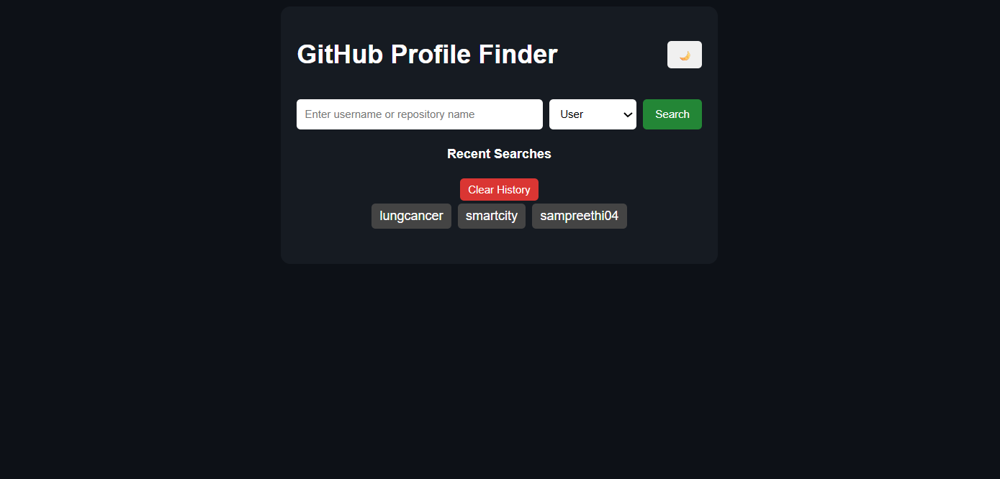
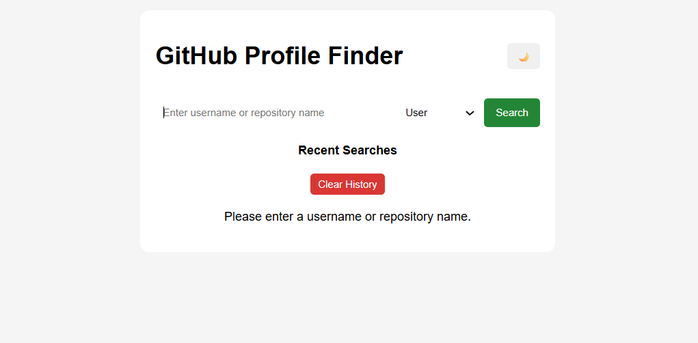

# GitHub Profile Finder

A responsive web application that enables users to search GitHub profiles and repositories using the **GitHub REST API**. The application allows users to search by **GitHub username** or **repository name**, view detailed profile information and repositories, switch between **Light** and **Dark** themes, and manage recent search history through a clean and interactive interface.

---

## Features

- **User Profile Search**  
  Search any GitHub user by entering their username and instantly retrieve their public profile information.

- **Repository Search**  
  Search public GitHub repositories by repository name and browse matching results.

- **Detailed Profile Information**  
  Displays the user's profile picture, full name, bio, location, company, followers, following count, and total public repositories.

- **Repository Listing**  
  View all public repositories associated with a GitHub user.

- **Profile Navigation**  
  Provides a direct link to the user's GitHub profile for quick access.

- **Light & Dark Theme**  
  Seamlessly switch between Light Mode and Dark Mode for a personalized browsing experience.

- **Recent Search History**  
  Automatically saves recent username and repository searches for quick access.

- **Clear Search History**  
  Remove all stored search history with a single click.

- **Error Handling**  
  Displays appropriate error messages for invalid usernames, unavailable repositories, or failed API requests.

- **Responsive Design**  
  Optimized layout that provides a seamless experience across desktops, tablets, and mobile devices.

- **GitHub REST API Integration**  
  Retrieves real-time GitHub data to ensure accurate and up-to-date profile and repository information.

---

## Technologies Used

- HTML5
- CSS3
- JavaScript (ES6)
- GitHub REST API

---

## Project Structure

```text
Github-profile-finder/
│
├── index.html
├── style.css
├── script.js
├── README.md
├── home-page.png
├── username-search.png
├── repository-search.png
├── themetoggle.png
└── search-history.png
```

---

## Installation

1. Clone the repository.

```bash
git clone https://github.com/sampreethi04/Github-profile-finder.git
```

2. Navigate to the project folder.

```bash
cd Github-profile-finder
```

3. Open `index.html` in any modern web browser.

No additional installation or dependencies are required.

---

## How It Works

1. Select the search type (**User** or **Repository**) from the dropdown menu.
2. Enter a GitHub username or repository name.
3. Click the **Search** button.
4. The application fetches real-time data from the GitHub REST API.
5. Profile information or repository search results are displayed.
6. Recent searches are automatically saved for future access.
7. Use the **Clear History** button to remove saved searches.
8. Switch between **Light Mode** and **Dark Mode** using the theme toggle.

---

## Screenshots

### Home Page



---

### Search by Username


---

### Search by Repository


---

### Theme Toggle (Light/Dark Mode)



---

### Recent Search History


---

## Repository Description

A responsive GitHub Profile Finder built with HTML, CSS, and JavaScript that enables username and repository search using the GitHub REST API, with Light/Dark mode and recent search history.

---

## Author

**Sampreethi Kookutla**
